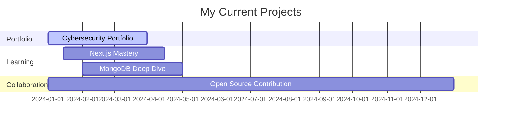

# 🚀 Hi there, I'm [Your Name]! 

<div align="center">
  
</div>

<div align="center">
  
  
  
</div>

---

## 🎯 About Me

```typescript
const developer = {
    name: "Your Name",
    role: "Cybersecurity Expert & Full-Stack Developer",
    location: "Bangladesh 🇧🇩",
    currentFocus: "Building secure, scalable applications",
    languages: ["JavaScript", "TypeScript", "Python", "Bash"],
    interests: ["Cybersecurity", "Web Development", "Chess ♟️", "Anime 🍜"],
    funFact: "I debug code during the day and watch anime at night!"
};
```

---

## 🔐 Current Project
> **Building a stunning portfolio for a cybersecurity expert** 🛡️
> 
> Showcasing skills, certifications, services, and achievements with modern design and security best practices. This project combines my passion for cybersecurity with cutting-edge web development technologies.

---

## 🤝 Let's Collaborate!

<div align="center">
  <a href="mailto:your.email@example.com">
    
  </a>
  <a href="https://linkedin.com/in/yourprofile">
    
  </a>
  <a href="https://twitter.com/yourhandle">
    
  </a>
  <a href="https://discord.com/users/yourdiscord">
    
  </a>
</div>

### 🌟 Open to collaborate on:
- 🔧 **Open-source security tools**
- 🎨 **Portfolio templates**
- 🔗 **Frontend-backend integration projects**
- 🛡️ **Cybersecurity research**
- 🚀 **Innovative web applications**

---

## 🧠 Currently Learning & Seeking Help

<table>
<tr>
<td width="50%">

### 📚 Learning
- **Next.js** - React framework mastery
- **MongoDB** - NoSQL database optimization
- **Advanced TypeScript** - Type safety expert
- **Cybersecurity Fundamentals** - Ethical hacking
- **Cloud Security** - AWS/Azure security

</td>
<td width="50%">

### 🆘 Need Help With
- **Next.js Optimization** - Performance tuning
- **Secure Authentication** - JWT, OAuth best practices
- **Production Deployment** - CI/CD pipelines
- **Code Reviews** - Security-focused reviews
- **Architecture Patterns** - Scalable designs

</td>
</tr>
</table>

---

## 💻 Tech Stack

<div align="center">

### 🚀 Frontend


### ⚙️ Backend & Database


### 🛡️ Security & Tools


</div>

---

## 💬 Ask Me About

<div align="center">
  
</div>

<details>
<summary>🎨 <strong>Frontend Frameworks</strong></summary>

- **React Ecosystem** - Hooks, Context, Redux
- **Next.js** - SSR, SSG, API routes
- **Performance Optimization** - Bundle splitting, lazy loading
- **State Management** - Redux, Zustand, Context API
</details>

<details>
<summary>📱 <strong>Responsive Design</strong></summary>

- **Mobile-First Approach** - Progressive enhancement
- **CSS Grid & Flexbox** - Modern layout techniques
- **Tailwind CSS** - Utility-first styling
- **Cross-Browser Compatibility** - Consistent UX
</details>

<details>
<summary>✨ <strong>Web Animations</strong></summary>

- **CSS Animations** - Keyframes, transitions
- **JavaScript Animations** - GSAP, Framer Motion
- **SVG Animations** - Interactive graphics
- **Performance** - 60fps animations
</details>

<details>
<summary>🎯 <strong>Portfolio That Actually Impresses</strong></summary>

- **Unique Design** - Stand out from the crowd
- **Interactive Elements** - Engage recruiters
- **Performance** - Fast loading times
- **SEO Optimization** - Better visibility
- **Accessibility** - Inclusive design
</details>

---

## 📊 GitHub Stats

<div align="center">
  
</div>

<div align="center">
  
</div>

<div align="center">
  
</div>

---

## 🏆 GitHub Trophies

<div align="center">
  
</div>

---

## 🎮 Fun Facts

<div align="center">
  <table>
    <tr>
      <td align="center" width="50%">
        
        <br>
        <strong>🍜 Anime Enthusiast</strong>
        <br>
        <em>Favorite Genres: Action, Thriller, Psychological</em>
        <br>
        <em>Currently Watching: [Your Current Anime]</em>
      </td>
      <td align="center" width="50%">
        
        <br>
        <strong>♟️ Chess Enthusiast</strong>
        <br>
        <em>Rating: [Your Rating] on Chess.com</em>
        <br>
        <em>Favorite Opening: Queen's Gambit</em>
      </td>
    </tr>
  </table>
</div>

---

## 🌟 Featured Repositories

<div align="center">
  <a href="https://github.com/yourusername/cybersecurity-portfolio">
    
  </a>
  <a href="https://github.com/yourusername/security-tools">
    
  </a>
</div>

---

## 🎵 Spotify Playing

<div align="center">
  
</div>

---

## 🌈 Random Dev Quote

<div align="center">
  
</div>

---

## 🔮 What I'm Working On



---

## 🚀 Let's Connect and Build Something Amazing!

<div align="center">
  
</div>

<div align="center">
  <h3>💬 "Code is like humor. When you have to explain it, it's bad." - Cory House</h3>
  <p>⭐ If you find my work interesting, consider giving my repos a star!</p>
  <p>🤝 Always open to connecting with fellow developers and security enthusiasts!</p>
</div>

---

<div align="center">
  
</div>

---

<div align="center">
  <sub>Built with ❤️ by <a href="https://github.com/yourusername">Your Name</a></sub>
</div>
